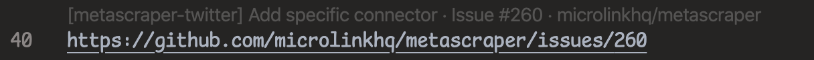

# rest-lens README

An advanced VS Code extension that calls HTTP endpoint when text matches a regular expression and displays the result as code lenses.

## Features

**Easily build programmable code lenses using just a simple JSON endpoint.**

Given the VS Code settings:

```jsonc
  "restLens.providers": {
    "github": {
      "pattern": "https://github\\.com/[^/]+/[^/]+/(?:issues|pull)/\\d+",
      "url": "http://localhost:2323/info"
    }
  }
```

…and an endpoint (example here implemented with Node.js):

```js
const express = require('express')
const app = express()
const got = require('got')
const metascraper = require('metascraper')([require('metascraper-title')()])
app.get('/info', async (req, res, next) => {
  try {
    const targetUrl = req.query.m[0]
    const { body: html, url } = await got(targetUrl)
    const metadata = await metascraper({ html, url })
    res.json({ title: metadata.title || url, url: targetUrl })
  } catch (error) {
    next(error)
  }
})
app.listen(+process.env.PORT || 2323)
```

This will display GitHub Issue and Pull Request titles as code lenses.



## Extension Settings

This extension contributes the following settings:

- `restLens.providers` An object of code lens providers, keyed by its ID (can be arbitrary string and is only used for informational and diagnostics purposes).
  Each code lens provider will be an object with the following properties:

  - `pattern` The regular expression to match against the document.
  - `url` The URL to invoke

## HTTP Endpoint Specification

### Request

The extension will make a GET request to the specified URL with the RegExp match as GET query parameter named `m[]`.

- `m[0]` The matched text
- `m[n]` The capture group matches

### Response

It should return a JSON object with the following properties:

- `title` The title to display on the code lens
- `url` The URL to open when clicking on the code lens
- `command`+`arguments` The VS Code command to execute when clicking on the code lens, overriding `url`

The response will be cached throughout the session until the "Clear response cache" command is invoked.
